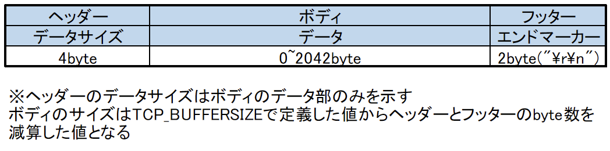

# OpenSocket
## 概要
windows(VC++)環境とLinux等の他環境で同様のソースコードを使用しソケット通信を簡略化し使用するためのライブラリです。

## build
./src/sample/内のファイルから実行したいものを一つ選び./src/sample.cppを上書きし以下コマンドを実行しビルドし実行する。
```sh
$ cmake -S . -B build
$ cmake --build build
$ ./build/OpenSocket.out
```
※windowsマシーン上でテストする際の注意点
wsl2上でserverを実行しclient側をwindowsで動作させるとudpの通信をする際client側で127.0.0.1を指定すると通信が届かない
windowsでnetstatで確認すると解放されていないのがわかる
対策として以下コマンドよりwsl2のipを確認し確認できたipをclientで指定する
```sh
$ ip a show dev eth0
```

## パケット図

